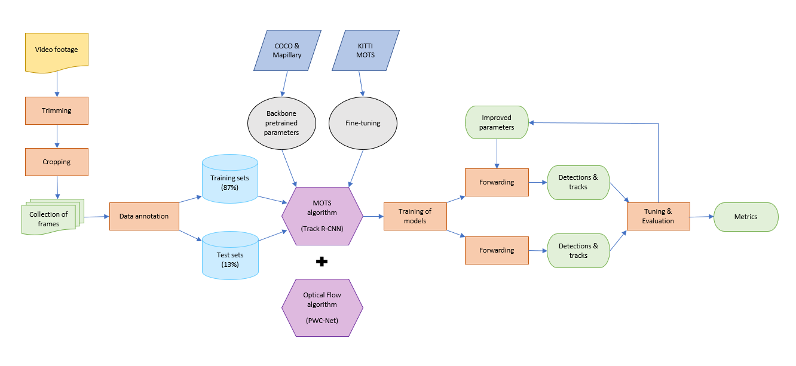
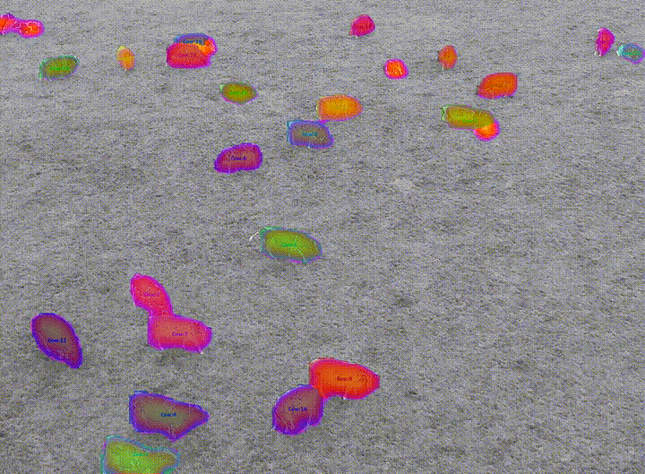
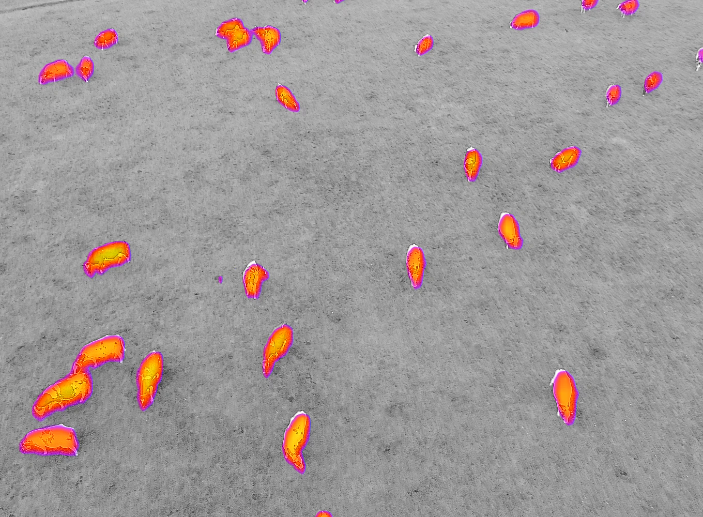
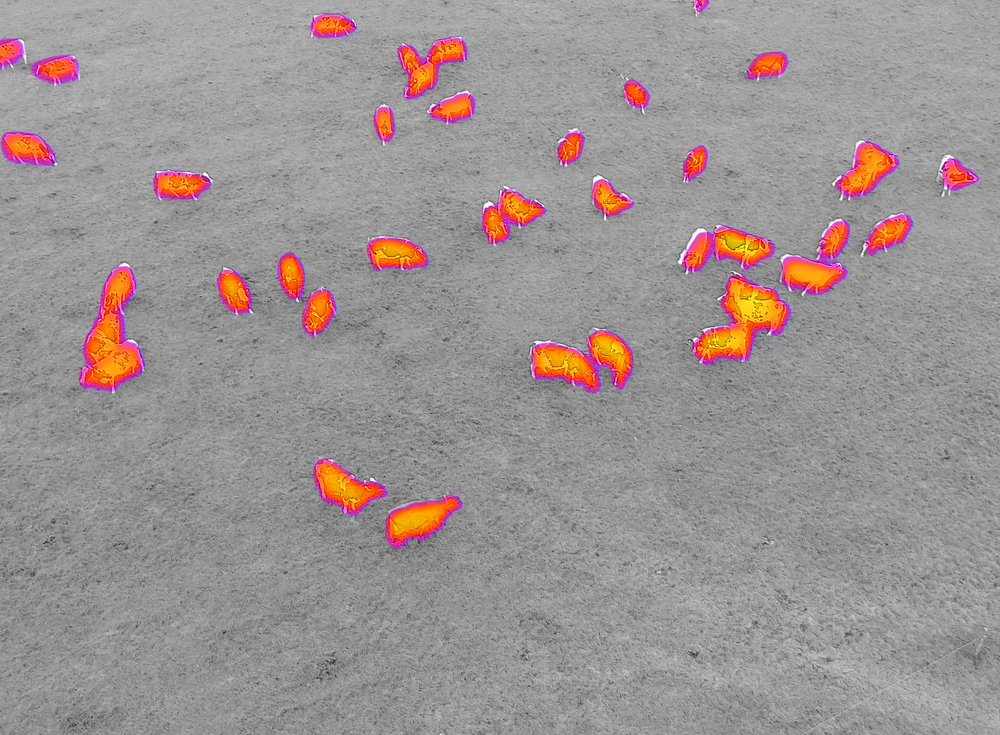
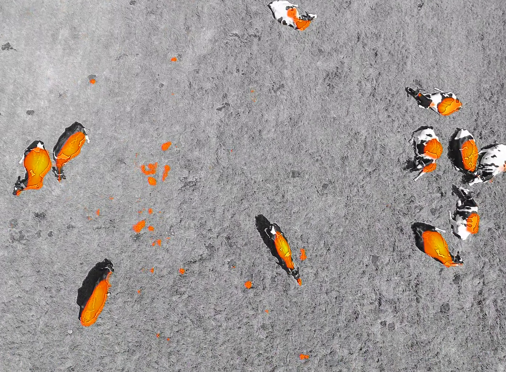
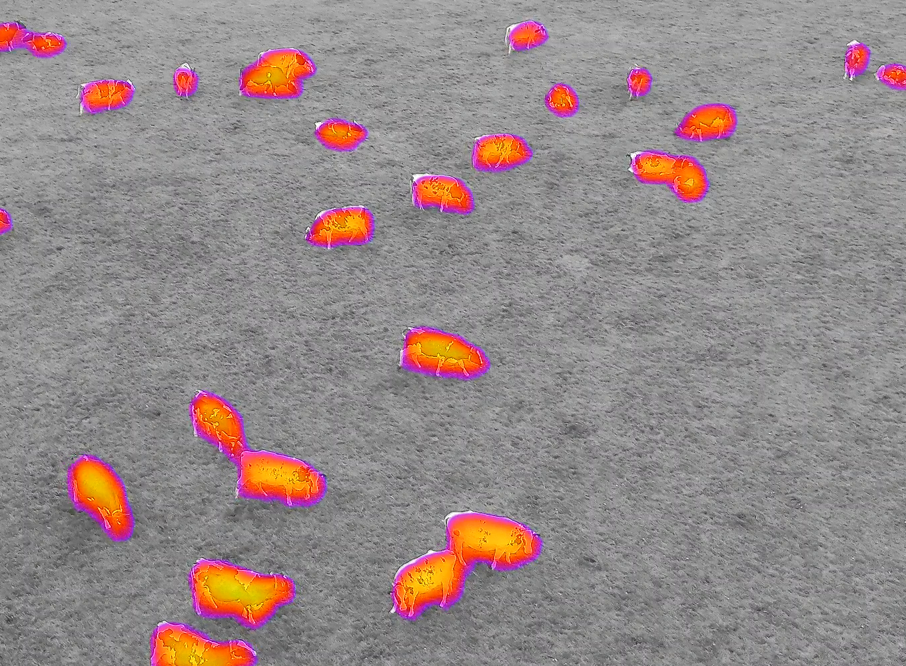
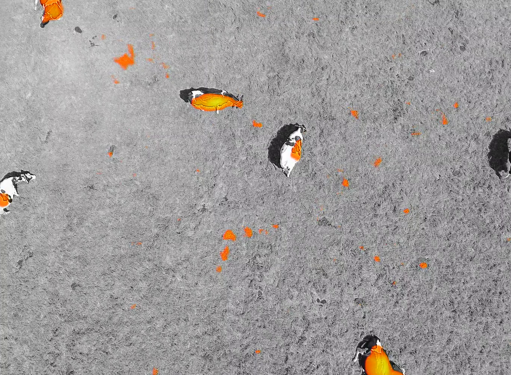
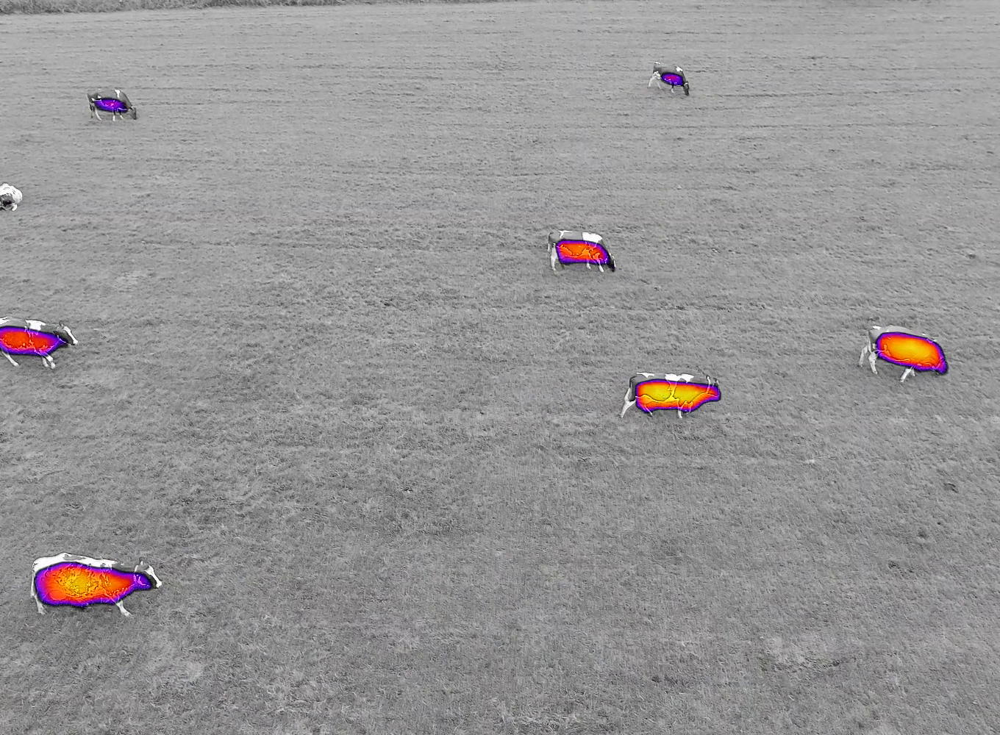
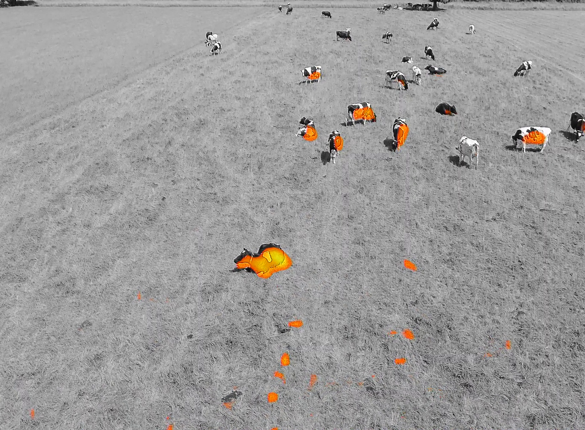
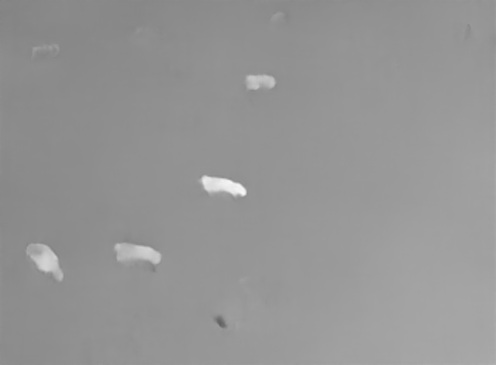

# Monitoring Mammalian Herbivores via Convolutional Neural Networks implemented on Thermal UAV imagery
This repository provides the code, images and annotations of the research "Monitoring Mammalian Herbivores via Convolutional Neural Networks implemented on Thermal UAV imagery".

# Research
In the [algorithms](algorithms/) folder, code for applying **TrackR-CNN** and **PWC-Net** to Multi Object Tracking and Segmentation (MOTS) is provided. PWC-Net is tested as an alternative tracking method to the association head used in TrackR-CNN. 

The flowchart below illustrates the steps followed to conduct this research:



# Models
Configuration files for the models can be found in algorithms/TrackR-CNN. I use two temporal components (3D convolutions and LSTM convolutions), and two tracking mechanisms (optical flow and an association head).

## Video of TrackR-CNN results



## Dataset

I created my own instance segmentation dataset, which I named **COW_MOTS**, in the fashion of the [KITTI_MOTS dataset](https://www.vision.rwth-aachen.de/page/mots).

COW_MOTS consists of 7 video sequences depicting aerial thermal imagery of cattle collected with a UAV in two outdoor farms in the Netherlands. Data was acquired at three temperatures (10ºC, 19ºC and 26.5ºC), under sunny and overcast weather conditions, at various angles of inclination (including nadir), and at heights ranging between 8-28 meters.

The COW_MOTS dataset consists of 959 frames, 20.647 masks, and 239 tracks. Ground truth was labelled manually with the Computer Vision Annotation Tool [CVAT](https://github.com/openvinotoolkit/cvat), run in a docker container. Go to the [preprocessing folder](preprocessing/) for instructions on using the annotation tool.

The following images are examples of the seven datasets that comprise COW_MOTS. They illustrate data collected at different atmospheric conditions (temperature and sunlight), heights, and angles of inclination:

 
 
 


Images and annotations of **COW_MOTS** will be made publicly available soon.

# Algorithms

## TrackR-CNN
Here, I provide a tutorial for applying the TrackR-CNN algorithm for a Multi-Object Tracking and Segmentation (MOTS) task to the COW_MOTS dataset or to a custom dataset.

If you want to apply **PWC-Net** together with **Track R-CNN**, instructions are provided at the end of this README.

### Video of results


### Installation and setup
#### Hardware
TrackR-CNN has been implemented on a high performance computer and on the Anunna High Performance Cluster (HPC).

High performance computer specs:
- NVIDIA Tital RTX videocard
- 64 GB RAM memory
- Intel® Core™ i9-10940X CPU @ 3.30GHz × 28
- Ubuntu 20.04.1 LTS

High Performance Cluster specs:
- NVIDIA Tesla V100
- 64 GB RAM memory
- Scientific linux

#### Requirements
- Install [Anaconda](https://www.anaconda.com/products/individual)
- Set up a virtual environment
    - `conda create --name myenv python=3.6.7`
    - `conda activate myenv`
- Clone (or download as a zip file) this repository
    - `git clone https://git.wur.nl/diego.barbulobarrios/TrackR-CNN.git`
- Navigate to the TrackR-CNN directory and install the requirements
    - `cd MOTS/algorithms/TrackR-CNN`
    - `pip install -r requirements.txt`
#### Folder structure
- Create the following folders in algorithms/TrackR-CNN:
    - `mkdir, forwarded, models, summaries, logs, data`
- After running the code, the algorithm's output will be stored in these folders:
    - `forwarded` will store the detection and tracking files and visualizations
    - `models` will store the trained models checkpoints. It also stores the models used for pre-training (COCO and Mapillary) and fine-tuning (KITTI MOTS).
    - `logs` will store a copy of the terminal's output during the training procedure.

Set your folder structure as follows:
```
data/
- COW_MOTS/
-- train/
--- images/
---- 0000/
----- 000000.png
----- 000001.png
----- ...
---- 0001/
---- ...
--- instances
---- 0000/
----- 000000.png
----- 000001.png
----- ...
---- 0001/
---- ...
models/
- conv3d_sep2/
-- conv3d_sep2-00000005.data-00000-of-00001
-- conv3d_sep2-00000005.index
-- conv3d_sep2-00000005.meta
- converted.data-00000-of-00001
- converted.meta
- converted.index
...
main.py
```
### Training
To train a model, navigate to `MOTS/algorithms/TrackR-CNN` and run `main.py` with the corresponding configuration file e.g., `python main.py configs/3dconv4` (`cd algorithms/TrackR-CNN`). If you are running the algorithm in Windows, you may get an error stating that the key **USER** has not been found among the environment variables. In this case, add it to the dictionary by writing `os.environ["USER"] = os.environ["USERNAME"]` at the beginning of the main() function in main.py

#### Configuration files
In the configuration files:

Point `KITTI_segtrack_data_dir` to your `train` folder; e.g., `"KITTI_segtrack_data_dir": "/home/saidlab/Thesis_DiegoBarbuloBarrios/MOTS/algorithms/TrackR-CNN/data/COW_MOTS/train/"`

Point `load_init` to the model pre-trained on COCO & Mapillary, e.g., `"load_init": "/home/saidlab/Thesis_DiegoBarbuloBarrios/MOTS/algorithms/TrackR-CNN/models/converted"`, or to the KITTI MOTS checkpoint used for fine-tuning, e.g., `"load_init": "/home/saidlab/Thesis_DiegoBarbuloBarrios/MOTS/algorithms/TrackR-CNN/models/conv3d_sep2-00000005"`. For pre-training and fine-tuning, you can download the models [here](https://omnomnom.vision.rwth-aachen.de/data/trackrcnn/).

Optimal values for the hyperparameters (epochs and batch size) used to train each model have to be found experimentally. On COW MOTS, 23 epochs and a small batch size of 4 give the best results.

As a temporal component, three models (3dconv) use two 3D convolutional layers and one model (lstm8) uses two stacked LSTM layers. The number at the end of the models' names refers to the batch size.

#### COW_MOTS
There are two possibilities to train TrackR-CNN on COW_MOTS.

1. Train a model pre-trained on COCO and Mapillary:
- Change in a config file:
    - Model name
    - Point `load_init` to the model pre-trained on COCO and Mapillary ("converted") in the "models" folder e.g., `"load_init": "/home/saidlab/Thesis_DiegoBarbuloBarrios/MOTS/algorithms/TrackR-CNN/models/converted"`.
    - Run `python main.py configs/<config_file_name>`

2. Train a model pre-trained on COCO and Mapillary and fine-tuned on KITTI MOTS:
- Change in a config file:
    - Model name
    - Point `load init` to the KITTI MOTS checkpoint in the "models" folder e.g., `"load_init": "/home/saidlab/Thesis_DiegoBarbuloBarrios/MOTS/algorithms/TrackR-CNN/models/conv3d_sep2-00000005"`
    - Run `python main.py configs/<config_file_name>`

If you want to use the best performing model (trained on COW_MOTS), you can download it [here](https://drive.google.com/drive/folders/17SVb5kvjAHM9P7BIQb5wgZjN6RZV4qQT?usp=sharing).

#### Custom dataset
To train TrackR-CNN on a custom dataset:
- Change in a config file:
    - Model name
    - Point `load init` to the model pre-trained on COCO and Mapillary or to the KITTI MOTS checkpoint in the "models" folder (see how in previous section "COW_MOTS").
    - Point `KITTI_segtrack_data_dir` to your `train` folder e.g., `"KITTI_segtrack_data_dir": "/home/saidlab/Thesis_DiegoBarbuloBarrios/MOTS/algorithms/TrackR-CNN/data/<your_datasaet>/train/"`.
    - Experimentally, find the optimal values for the batch size and the number of epochs.
    - Set `"input_size_train"` and `"input_size_val"` to your images' resolution.
- Change the maximum number of detections:
    - Navigate to `MOTS/algorithms/TrackR-CNN/datasets/KITTI/segtrack/KITTI_segtrack.py` and change the variable `N_MAX_DETECTIONS` the maximum number of detections (frame with highest number of targets) in your dataset. A higher value than the highest number would also work.


### Forwarding and tracking
First, make sure to add the datasets on which you want to apply forwarding and tracking to the **train** folder before running the respective procedures.

To obtain the models' detections, run the following command on the terminal:
```
python main.py configs/CONFIG_FILE_NAME "{\"task\":\"forward_tracking\",\"dataset\":\"KITTI_segtrack_feed\",\"load_epoch_no\":5,\"batch_size\":5,\"export_detections\":true,\"do_tracking\":false,\"video_tags_to_load\":[\"0000\",\"0001\",\"0002\",\"0003\",\"0004\",\"0005\",\"0006\"]}"
```
Use `video_tags_to_load` to choose on which datasets you want the predictions to be made. Make sure to set `load_epoch_no` to the number of epochs on which the model has been trained. In case you have saved several versions of the model at different points of the training procedure, keep in mind that the value you input in `load_epoch_no` is used to find the models' version with which you want to make predictions. 
The command's output will be written to the **forwarded** folder.

To link over time the detections obtained by the previous command, run:
```
python main.py configs/CONFIG_FILE_NAME
"{\"build_networks\":false,\"import_detections\":true,\"task\":\"forward_tracking\",\"dataset\":\"KITTI_segtrack_feed\",\"do_tracking\":true,\"visualize_detections\":false,\"visualize_tracks\":false,\"load_epoch_no\":5,\"video_tags_to_load\":[\"0000\",\"0001\",\"0002\",\"0003\",\"0004\",\"0005\",\"0006\"]}"
```
Visualizations will be stored in `forwarded/<model_name>/vis/tracks`.

#### Visualization
To change the class assigned to the detections (e.g., cow), go to `TrackR-CNN/mots_tools/mots_vis/visualize_mots.py` and change the `category_name` from "Cow" to the desired class. In case you want to detect and track more than one class, also change the second `category_name` from "Pedestrian" to the desired class and, if needed, add more classes.

### Tuning
The tuning procedure is used to find the best tracking parameters for the model on a specific dataset. It relies on a random search approach on the training dataset, after which the best parameters are tested on the test dataset and the tracking metrics are calculated.

Before running the tuning procedure, make sure to add both training and testing datasets to the **train** folder. In order to specify the training and testing sequences, follow this procedure:
- Navigate to `MOTS/algorithms/TrackR-CNN/mots-tools/mots_eval/`
- Add the sequences for training to **train.seqmap** and the sequences for testing to **val.seqmap** in the following format: 
    - `<seq_id> empty <start_frame> <end_frame>`

To conduct the tuning procedure, run:
```
python scripts/eval/segtrack_tune_experiment.py /path/to/detections/ /path/to/groundtruth/ /path/to/precomputed_optical_flow/ /path/to/output_file /path/to/tmp_folder/ /path/to/mots_eval/ association_type num_iterations
```
where `/path/to/detections/` is the folder containing the detections obtained by running the "forwarding" command above; `/path/to/mots_eval/` refers to the "mots eval" folder contained in the "mots tools" directory; `association_type` determines the method (association head or optical flow) for associating detections into tracks and is either `reid` (relying on the association head), `mask` (using optical flow), `bbox_iou` (using bounding box warping with median optical flow) or `bbox_center` (using nearest neighbor matching); `num_iterations` is the number of random trials (1000 in this study); `/path/to/groundtruth/ ` refers to the `instances` or `instances_txt` folder containing the annotations; `/path/to/precomputed_optical_flow` has to be set to a folder containing the optical flow images - namely when setting `association_type` to `mask` or `bbox_iou` but if you set it to something else, then the flow path is ignored; at `/path/to/output_file`, a file will be created containing the results of the individual tuning iterations, please make sure this path is writable; at `/path/to/tmp_folder` a lot of intermediate folders will be stored, you can delete these afterwards.

### Evaluation
The code from the [mots_tools repository](https://github.com/VisualComputingInstitute/mots_tools) has been included in this respository to make the evaluation of the results easier and faster.

To obtain all the metrics for your model on the testing dataset, run `eval.py` in `mots_tools/mots_eval`. Before running the script, set the right path to the "mots tools" folder e.g., `sys.path.append(/home/saidlab/Thesis_DiegoBarbuloBarrios/MOTS/algorithms/TrackR-CNN/mots_tools/)`.

#### Counting
In order to get the counting results of the model on your dataset, run `eval.py` and look at the **TR Trk** metric results (i.e., number of tracks predicted by the model). To test the model's counting efficiency, compare it with the ground truth tracks, which you can find under the metric **GT Trk**.

## Optical Flow
To use optical flow as a tracking mechanism, follow the instructions below for generating optical flow images from the COW_MOTS dataset and naming them according to the format required by TrackR-CNN.

### Video of results

 

PWC-Net detects pixel motion between consecutive frames, so only the cows in movement are detected by the algorithm.

### PWC-Net
I use a [simpler reimplementation](https://github.com/sniklaus/pytorch-pwc) of the [official repository](https://github.com/NVlabs/PWC-Net) that provides the same results.

#### Setup
- Install [Anaconda](https://www.anaconda.com/products/individual)
- Create an environment
    - `conda create --name myenv python=3.6.7`
    - `conda activate myenv`
- Navigate to pytorch-pwc directory and install the requirements
    - `cd MOTS/algorithms/PWC-Net/flow_files/pytorch-pwc`
    - `pip install -r requirements.txt`

#### Flow-files
To get a flow file from every pair of adjacent images in your dataset, follow these steps:

- Go to `MOTS/algorithms/PWC-Net/flow_files/pytorch-pwc/` and, in the **estimate()** function, insert your images' resolution values in **intWidth** and **intHeight**.
- Store the dataset's images in the **images** folder.
    - Make sure to either name your images according to the format used for TrackR-CNN (e.g., 000000.png, 000001.png, etc.) or to change the code in the script to fit the format you are using.
- Navigate to `MOTS/algorithms/PWC-Net/flow_files` and run the **flow_files_generator.py** script.

The **flow_files_generator.py** script will produce a flow file from every pair of consecutive images and write it to the **out** folder.

### UV-files
#### Setup
- Create an environment in Anaconda
- Clone (or download as a zip file) this repository
    - `git clone https://github.com/georgegach/flowiz.git`
- Install requirements

#### Running the code
To generate a pair of UV images from each flow file (previously generated from the datasets' images), follow these steps:

- Go to `MOTS/algorithms/PWC-Net/UV_files/flowiz/flowiz` and open  the **UV_files_generator.py** script.
- Change the string in variable **a** to a path pointing to the flow-files' folder, and those of variables **b** and **c** to paths pointing to the output folders to which images representing U V channels will be written.
- Run **UV_files_generator.py**

### Minimum flow values
To obtain the minimum flow value of each flow file (a requirement to run optical flow within TrackR-CNN), this repository provides code from the [Middlebury evaluation](https://vision.middlebury.edu/flow/submit/) under the **color_files_&_minimum_flow** folder.

#### Runing the code
Follow these steps:

- Navigate to `MOTS/algorithms/PWC-Net/color_files_&_minimum_flow/Middlebury_evaluation` and open the **colorimage_&_minflow.py** script.
- Modify the strings within the os.system() method so that it points to the folder containing the flow files. 
- The minimum and maximum flow values for each flow file's U V channels are part of the terminal output. Make sure to save this output to a log to later extract the minimum-flow values.
- Run the script

### Renaming
#### Running the code
As a final step for using optical flow as a tracking mechanism in TrackR-CNN, you will have to rename the U V files in accordance with the format required by TrackR-CNN. To do so, follow these steps:

- Go to `MOTS/algorithms/PWC-Net/rename_UV/Optical-flow` and open the **Renaming_UV_images** script.
- Point **log_path** to the logs containing the minimum-flow values and point **path** to a folder containing the UV images.
- Run the script

The script renames UV images with the format required by TrackR-CNN (e.g., 000000_x_minimal-4.png, 000000_y_minimal-2.png, etc.); where the terminations "x" and "y" denote, respectively, the U and V channels, and the number is the rounded minimum flow value. For example, 000006_x_minimal-3.png describes the flow in x direction for frame 6.

After generating the optical flow images, change the following in the tuning procedure:
- Point the `/path/to/precomputed_optical_flow` to the location where the optical flow images are stored. 
- Set `association type` either to **mask** or to **bbox_iou** so that optical flow is used as a tracking mechanism.

Now, you can run the tuning procedure with optical flow, instead of the association head, as a tracking mechanism.

### Using Optical flow as a tracking mechanism
After generating the optical flow images and renaming them according to the format required by Track R-CNN, change the following in the tuning procedure:
- Point the `/path/to/precomputed_optical_flow` to the location where the optical flow images are stored. 
- Set `association type` either to **mask** or to **bbox_iou** so that optical flow is used as a tracking mechanism.

Now, you can run the tuning procedure with optical flow, instead of the association head, as a tracking mechanism. 

## References
The TrackR-CNN code and parts of the README come from [TrackR-CNN](https://github.com/VisualComputingInstitute/TrackR-CNN). The PWC-Net and flowiz code have been obtained from [PWC-Net](https://github.com/sniklaus/pytorch-pwc) and [flowiz](https://github.com/georgegach/flowiz).

## Citation
If you use this code, please cite:
```
@inproceedings{Voigtlaender19CVPR_MOTS,
 author = {Paul Voigtlaender and Michael Krause and Aljosa Osep and Jonathon Luiten and Berin Balachandar Gnana Sekar and Andreas Geiger and Bastian Leibe},
 title = {{MOTS}: Multi-Object Tracking and Segmentation},
 booktitle = {CVPR},
 year = {2019},
}
@inproceedings{Sun_CVPR_2018,
author = {Deqing Sun and Xiaodong Yang and Ming-Yu Liu and Jan Kautz},
title = {{PWC-Net}: {CNNs} for Optical Flow Using Pyramid, Warping, and Cost Volume},
booktitle = {IEEE Conference on Computer Vision and Pattern Recognition},
year = {2018}
}
@misc{pytorch-pwc,
author = {Simon Niklaus},
title = {A Reimplementation of {PWC-Net} Using {PyTorch}},
year = {2018},
howpublished = {\url{https://github.com/sniklaus/pytorch-pwc}}
}
GitHub - georgegach/flowiz: Converts Optical Flow files to images and optionally compiles them to a video. Flow viewer GUI is also available. Check out mockup right from Github Pages: https://github.com/georgegach/flowiz.
```

## Contact
If you encounter problems when running the code or have any questions, please open an issue or contact diegobarbulobarrios@gmail.com
