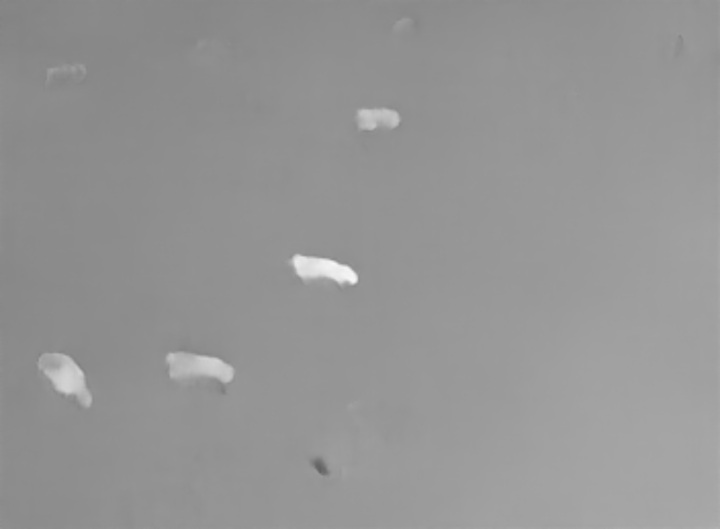

# Optical Flow
Here, I provide the scripts and tutorials for generating optical flow images from our COW MOTS dataset. Once these images have been generated, optical flow will be used as a tracking mechanism in the TrackR-CNN algorithm (go to the TrackR-CNN readme for instructions).

## Video of results

 
 

PWC-Net detects pixel motion between consecutive frames, so only the cows in movement are detected by the algorithm.

## PWC-Net
I use a simpler reimplementation (https://github.com/sniklaus/pytorch-pwc) of the official repository (https://github.com/NVlabs/PWC-Net) that provides the same results.

### Setup
- Install [Anaconda](https://www.anaconda.com/products/individual)
- Create an environment
    - `conda create --name myenv python=3.6.7`
    - `conda activate myenv`
- Clone (or download as a zip file) this repository
    - `git clone <link_to_my_repo>`
- Navigate to pytorch-pwc directory and install the requirements
    - `cd MOTS/algorithms/PWC-Net/flow_files/pytorch-pwc`
    - `pip install -r requirements.txt`

### Flow-files
To get a flow file from every pair of adjacent images in your dataset, follow these steps:

- Go to `MOTS/algorithms/PWC-Net/flow_files/pytorch-pwc/` and, in the **estimate()** function, insert your images' resolution values in **intWidth** and **intHeight**.
- Store the dataset's images in the **images** folder.
    - Make sure to either name your images according to the format used for TrackR-CNN (e.g., 000000.png, 000001.png, etc.) or to change the code in the script to fit the format you are using.
- Navigate to `MOTS/algorithms/PWC-Net/flow_files` and run the **flow_files_generator.py** script.

The **flow_files_generator.py** script will produce a flow file from every pair of consecutive images and write it to the **out** folder.

## UV-files
### Setup
- Create an environment in Anaconda
- Clone (or download as a zip file) this repository
    - `git clone <https://github.com/georgegach/flowiz.git>`
- Install requirements

### Running the code
To generate a pair of UV images from each flow file (previously generated from the datasets' images), follow these steps:

- Go to `MOTS/algorithms/PWC-Net/UV_files/flowiz/flowiz` and open  the **UV_files_generator.py** script.
- Change the string in variable **a** to a path pointing to the flow-files' folder, and those of variables **b** and **c** to paths pointing to the output folders to which images representing U V channels will be written.
- Run **UV_files_generator.py**

## Minimum flow values
To obtain the minimum flow value of each flow file (a requirement to run optical flow within TrackR-CNN), this repository provides code from the Middlebury evaluation [link](https://vision.middlebury.edu/flow/submit/) under the **color_files_&_minimum_flow** folder.

### Runing the code
Follow these steps:

- Navigate to `MOTS/algorithms/PWC-Net/color_files_&_minimum_flow/Middlebury_evaluation` and open the **colorimage_&_minflow.py** script.
- Modify the strings within the os.system() method so that it points to the folder containing the flow files. 
- The minimum and maximum flow values for each flow file's U V channels are part of the terminal output. Make sure to save this output to a log to later extract the minimum-flow values.
- Run the script

## Renaming
### Running the code
As a final step for using optical flow as a tracking mechanism in TrackR-CNN, you will have to rename the U V files in accordance with the format required by TrackR-CNN. To do so, follow these steps:

- Go to `MOTS/algorithms/PWC-Net/rename_UV/Optical-flow` and open the **Renaming_UV_images** script.
- Point **log_path** to the logs containing the minimum-flow values and point **path** to a folder containing the UV images.
- Run the script

The script renames UV images with the format required by TrackR-CNN (e.g., 000000_x_minimal-4.png, 000000_y_minimal-2.png, etc.); where the terminations "x" and "y" denote, respectively, the U and V channels, and the number is the rounded minimum flow value. For example, 000006_x_minimal-3.png describes the flow in x direction for frame 6.

## References
The PWC-Net and flowiz code have been obtained from [PWC-Net](https://github.com/sniklaus/pytorch-pwc) and [flowiz](https://github.com/georgegach/flowiz).

## Citation
If you use this code, please cite:
```
@inproceedings{Sun_CVPR_2018,
author = {Deqing Sun and Xiaodong Yang and Ming-Yu Liu and Jan Kautz},
title = {{PWC-Net}: {CNNs} for Optical Flow Using Pyramid, Warping, and Cost Volume},
booktitle = {IEEE Conference on Computer Vision and Pattern Recognition},
year = {2018}
}
@misc{pytorch-pwc,
author = {Simon Niklaus},
title = {A Reimplementation of {PWC-Net} Using {PyTorch}},
year = {2018},
howpublished = {\url{https://github.com/sniklaus/pytorch-pwc}}
}
GitHub - georgegach/flowiz: Converts Optical Flow files to images and optionally compiles them to a video. Flow viewer GUI is also available. Check out mockup right from Github Pages: https://github.com/georgegach/flowiz.
```

## Contact
If you have encounter problems when running the code or have any questions, please open an issue or contact diego.barbulobarrios@wur.nl. 


